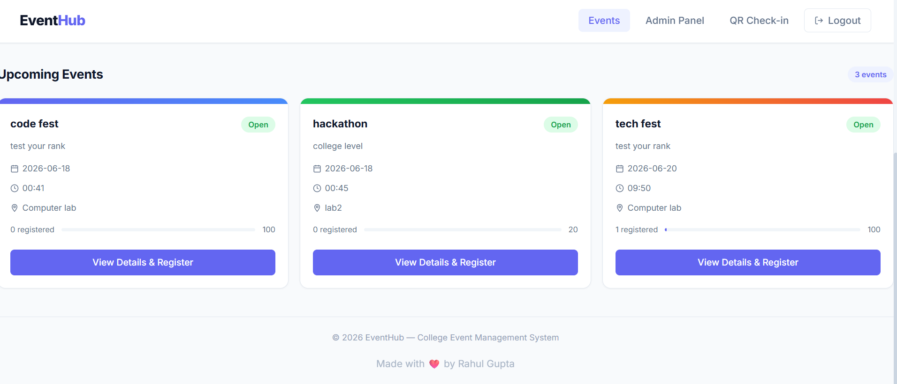
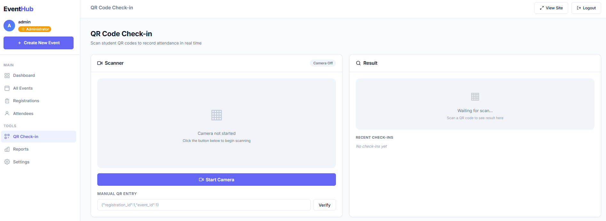
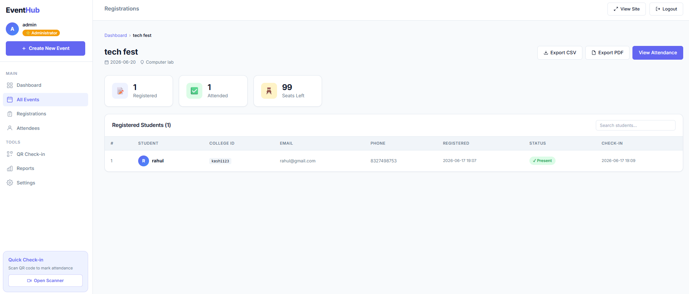

# 🎓 EventHub – College Event Management System

EventHub is a modern web-based college event management platform that simplifies event organization, student registration, attendance tracking, and QR-based check-in. The system provides an intuitive interface for students to discover and register for events while enabling administrators to efficiently manage events and monitor participation.

---

## 🚀 Features

### 👨‍🎓 Student Features

* Browse upcoming campus events
* View detailed event information
* Register for events online
* Automatic QR code generation upon registration
* Registration confirmation page
* Digital event pass with QR code
* Responsive and modern user interface

### 👨‍💼 Admin Features

* Secure admin authentication
* Create new events
* Edit existing events
* Delete events
* View event registrations
* Monitor attendance statistics
* QR-based attendee verification
* Export attendance data to CSV
* Export attendance reports to PDF

### 📱 QR Check-In System

* Unique QR code generated for every registration
* Fast attendee verification
* Prevent duplicate check-ins
* Real-time attendance tracking
* Secure event entry management

---

## 🛠️ Tech Stack

### Frontend

* HTML5
* CSS3
* JavaScript
* Jinja2 Templates

### Backend

* Python
* Flask

### Database

* SQLite

### Additional Libraries

* QRCode
* ReportLab
* Gunicorn

---

## 📂 Project Structure

```text
EventHub/
│
├── app.py
├── database.db
├── requirements.txt
│
├── static/
│   ├── css/
│   ├── js/
│   └── images/
│
├── qr_codes/
│
└── templates/
    ├── base.html
    ├── index.html
    ├── register.html
    ├── confirmation.html
    ├── admin_login.html
    ├── admin.html
    ├── event_form.html
    ├── registrations.html
    ├── attendance.html
    └── checkin.html
```

---

## 📸 Screenshots

### 🏠 Homepage


---

### 🎉 Events Listing


---

### 📝 Event Registration


---

### 📱 QR Code Pass


---

### 🔐 Admin Login


---

### ➕ Create Event


---

### 👥 Registrations Management



---

### 📷 QR Check-In System



---

### 📈 Attendance Report



---

## ⚙️ Installation

### Clone Repository

```bash
git clone https://github.com/rahulgupta-cse/eventhub.git
cd EventHub
```

### Create Virtual Environment

```bash
python -m venv venv
```

### Activate Environment

Windows:

```bash
venv\Scripts\activate
```

Mac/Linux:

```bash
source venv/bin/activate
```

### Install Dependencies

```bash
pip install -r requirements.txt
```

### Run Application

```bash
python app.py
```

Application will start at:

```text
http://127.0.0.1:5000
```

---

## 📊 System Workflow

1. Admin creates an event.
2. Students browse available events.
3. Students register online.
4. QR code is generated automatically.
5. Student receives registration confirmation.
6. Student presents QR code at event venue.
7. Admin scans and verifies QR code.
8. Attendance is recorded automatically.
9. Reports can be exported as CSV or PDF.

---

## 🌟 Future Enhancements

* Email notifications
* Payment gateway integration
* Multi-admin support
* Event categories
* Analytics dashboard
* Student login system
* Cloud database integration
* Mobile application support

---

## 🤝 Contributing

Contributions are welcome.

1. Fork the repository
2. Create your feature branch
3. Commit your changes
4. Push to your branch
5. Create a Pull Request

---

## 📄 License

This project is developed for educational and academic purposes.

---

## 👨‍💻 Developer

**Rahul Gupta**

Crafted with ❤️ using Flask and Python.

---

## ⭐ Support

If you found this project helpful, please consider giving it a star on GitHub.
